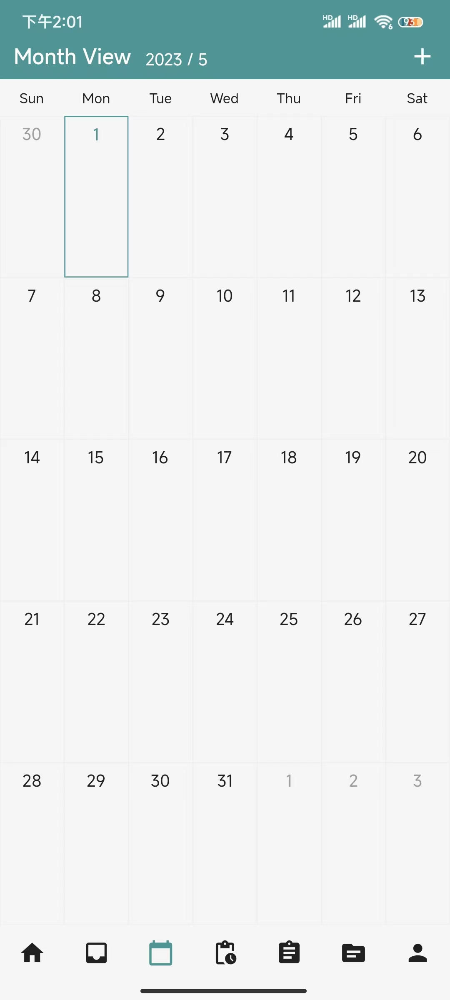
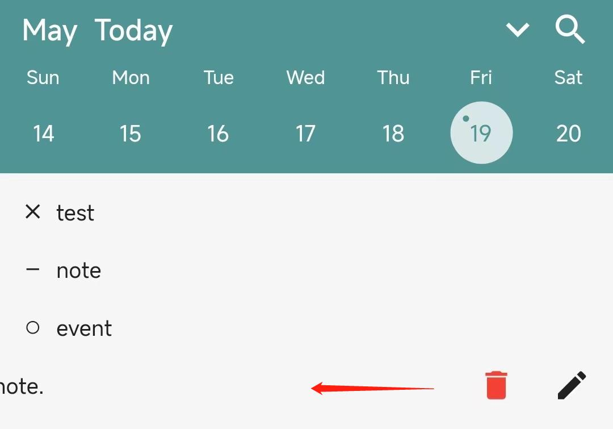

# Bullet FAQ


Bullet is a Bullet Journal style diary app.

[TOC]

## Getting started

### Download

Bullet support Android and IOS. You can download from these.

[Android](https://play.google.com/store/apps/details?id=com.mizhichashao.bujo_flutter) [https://play.google.com/store/apps/details?id=com.mizhichashao.bujo_flutter](https://play.google.com/store/apps/details?id=com.mizhichashao.bujo_flutter)

[IOS](https://apps.apple.com/us/app/id1581227244?l=en-us&platform=iphone) [https://apps.apple.com/us/app/id1581227244?l=en-us&platform=iphone](https://apps.apple.com/us/app/id1581227244?l=en-us&platform=iphone)

### About Bullet Journal


#### Index

In Bullet Journal, The first page of your Bullet Journal should be the index. Make a list of the items you’ll be tracking with your bullet journal.

But in **Bullet** there was no index. But you can find a collection from the collection list.

#### Future Log

Important and interesting things in your future can be saved in Future Log.



There also a Future in **Bullet**, it will display a year's Future Log.

You can add a log and drag to other yeas's logs.

#### Monthly Logs

In Bullet Journal the Monthly Logs can write specific events and get a bird’s eye view of what happened during the month.

But Bullet doesn't has a Monthly Logs. Instead, **Bullet** has a Month View. It will show logs in a monthly view.


#### Daily Logs

The Daily Log is designed for day-to-day use. There is Daily Logs in **Bullet** too.

#### Bullet Journal style symbols

``` - ``` Note

Notes include: facts, ideas, thoughts, and observations. Notes are entries that you want to remember but aren’t immediately or necessarily actionable. This Bullet works well for meeting, lecture, or classroom notes.

``` o ``` Event

Events are date-related entries that can either be scheduled (e.g. “Charlie’s birthday”) or logged after they occur (e.g. “signed the lease”).

``` • ``` Task

Task can be any kind actionable items, it can be change status to Completed, Migrated, Scheduled.

``` x ``` Task Complete

``` > ``` Task Migrated (A task that's been moved forward into the next Monthly Log or a Collection)

``` < ``` Task Scheduled (A task that's been moved backward into the Future Log)

#### Collection

In Bullet Journal, the collection is list for notes and tasks that are related by a common theme or purpose.

In **Bullet**, it also has collections. You can create collections, but you didn't need to add items in collections. What you need is bind collection when you are creating a item and it will auto showed in the Collection Detail Page.

## Basic Tutorial

### Item

#### Create a item

Tap the add btn in Daily Logs page, you can open the add view.


Just add the item content and notes (optional) and tap the send btn to save the item!

#### Update item

If you want to edit or del a item, you can drag the item to left in the logs list and you will see two btns: Delete and Edit.



If you want to change the task status, you can drag the item to right in log list and you will see three task just tap and task status will be changed.


### Collection

#### Create a collection

You can tap the add btn in collection list page it will jump to the collection new page.


#### Edit or add sub collection

You can drag the collection to left in collection list page and you will see three btns: Archive, Edit, Add Sub Collection.


### Bind items with Collection

If you want to bind item with collection, you should tap the collection btn in edit view and it will show you the bind view. Just select the collection you want to bind and comfirm.


You don't need to bind item with the parent collection you just need to bind it to the sub collection. You can see the next image, *Swimming* is the sub collection for *Sport*. When the item only bind with *Swimming*, it will showed in both collection Detail.


### Mainly Pages Description

You can tap the bottom bar to change the page.


The Btns in bottom bar is: 

**Daily Logs**, the Bullet Journal daily logs page.

**Inbox**, All logs will show in this list and you can also search items here.

**Month View**, the month view is similar with [Monthly Logs](#Monthly Logs).

**Future Logs**, the Bullet Journal future logs page.

**Data Statistics**, your BuJo statistics will be showed here.

**Collection List**, the collection list page.

**Setting**, the setting page.

